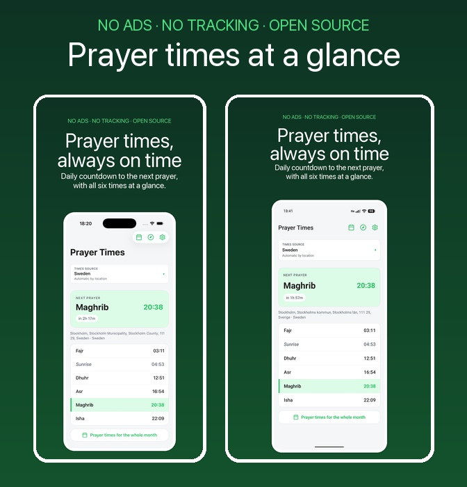
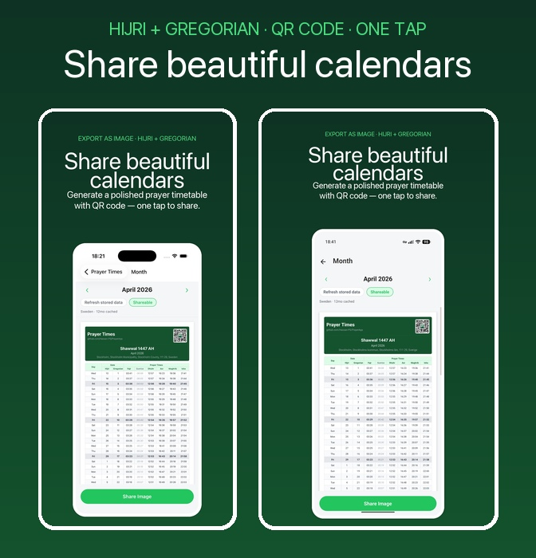
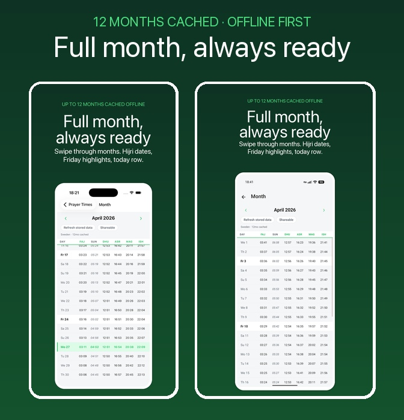
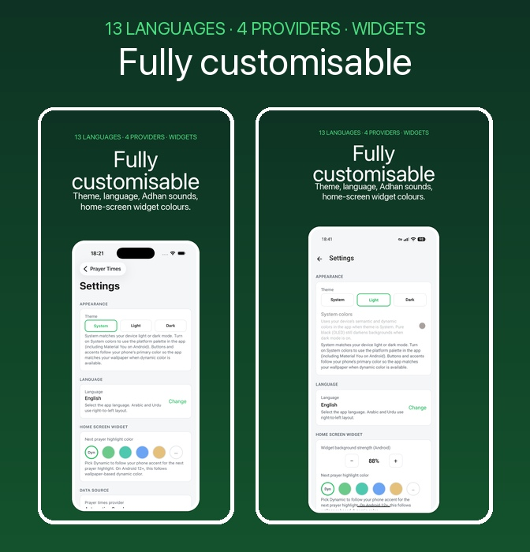

<div align="center">
  

  # Mihrab — prayer times, calmly

  A simple, fast, and privacy-focused app for daily prayer times, Qibla direction, the Quran, dua and tasbih, fasting log, and home-screen widgets.

  <br>

  <table><tr>
    <td><a href="https://apps.apple.com/us/app/prayer-salah-times-qibla/id6762085256"></a></td>
    <td><a href="https://github.com/Hassan-PS/Mihrab/releases/latest/download/app-fdroid-release.apk"></a></td>
    <td><a href="https://apps.obtainium.imranr.dev/redirect?r=obtainium://app/%7B%22id%22%3A%22com.prayer_times%22%2C%22url%22%3A%22https%3A%2F%2Fgithub.com%2FHassan-PS%2FMihrab%22%2C%22author%22%3A%22Hassan-PS%22%2C%22name%22%3A%22Mihrab%22%7D"></a></td>
  </tr></table>

</div>

---

## Features

- **No Ads & Full Privacy** — No tracking, no data collection, fully open-source.
- **Accurate Prayer Times** — Daily times or a full month view, up to a year ahead.
- **Offline First** — Prayer times are cached on-device so the app loads instantly and works without a connection.
- **Home Screen Widgets** — Customisable iOS and Android widgets showing the next prayer at a glance.
- **Qibla Compass** — Accurate direction to the Kaaba using your device's sensors.
- **Adhan & Reminders** — Notifications with built-in Adhan sounds and pre-prayer alerts.
- **Multiple Providers** — AlAdhan, PrayerTimes.dev, Islamiska Förbundet (Sweden), or on-device calculation.
- **Multi-Language** — English, Arabic, Swedish, Bengali, Urdu, Hindi, French, Spanish, German, Turkish, Indonesian, Russian, and Chinese.

---

## Screenshots

<div align="center">

&nbsp;

&nbsp;



</div>

---

## Install

| Platform | Link |
|---|---|
| **iOS** | [App Store](https://apps.apple.com/us/app/prayer-salah-times-qibla/id6762085256) |
| **Android APK** | [GitHub Releases](https://github.com/Hassan-PS/Mihrab/releases) → `app-fdroid-release.apk` |
| **Android (Obtainium)** | [Add to Obtainium](https://apps.obtainium.imranr.dev/redirect?r=obtainium://add/https://github.com/Hassan-PS/Mihrab) — auto-updates directly from GitHub Releases |
| **Google Play** | Coming soon |
| **F-Droid** | Coming soon ([MR #36312](https://gitlab.com/fdroid/fdroiddata/-/merge_requests/36312)) |

---

## Build

```sh
npm install
npm start
```

### Android

```sh
# F-Droid APK (no Play Billing)
npm run android:assembleFdroidRelease

# Google Play AAB
npm run android:bundlePlayRelease
```

Outputs:
- F-Droid APK: `android/app/build/outputs/apk/fdroid/release/app-fdroid-release.apk`
- Play AAB: `android/app/build/outputs/bundle/playRelease/app-play-release.aab`

### iOS

```sh
npm run ios
```

Archive and upload via Xcode Organizer for App Store / TestFlight.

---

## License

[Apache-2.0](LICENSE)
