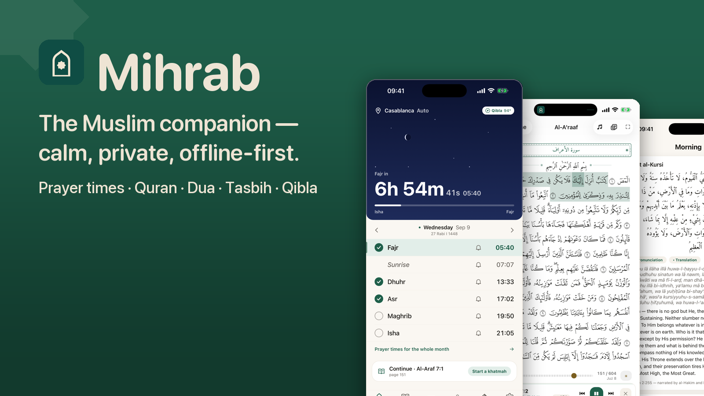
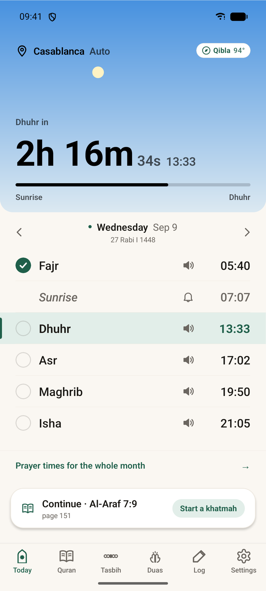
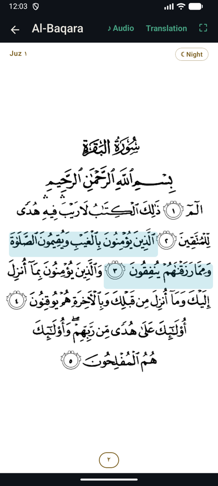
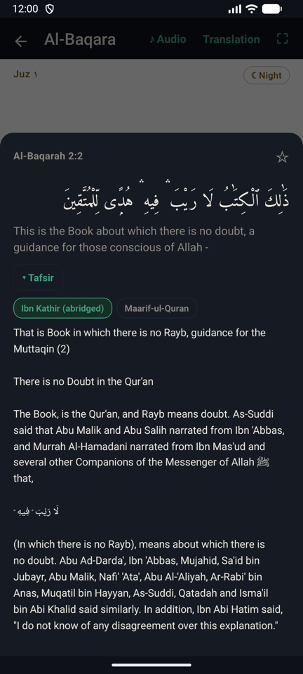
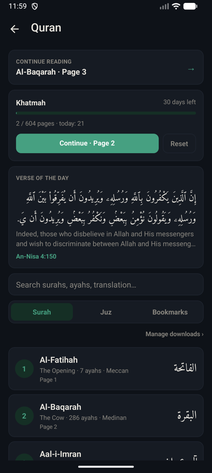
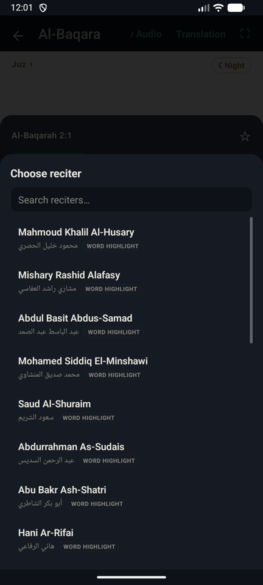
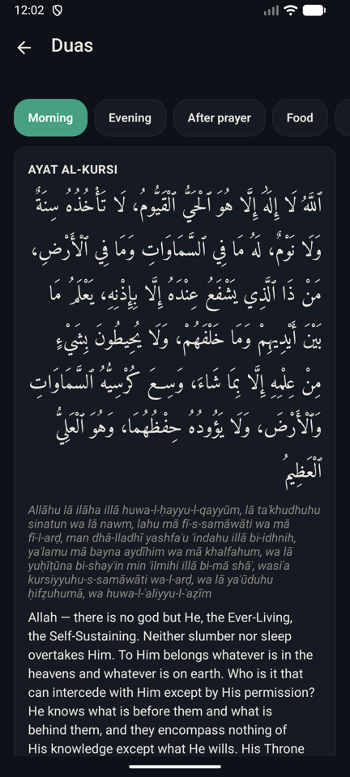

<div align="center">
  

  A calm, private, offline-first companion for the day's intentions. Prayer times, a full interactive Quran with recitation and tafsir, dua and tasbih, Qibla, fasting + prayer journal, and home-screen widgets — no ads, no analytics, no tracking.

  <br>

  <table><tr>
    <td><a href="https://apps.apple.com/us/app/prayer-salah-times-qibla/id6762085256"></a></td>
    <td><a href="https://play.google.com/store/apps/details?id=com.prayer_times"></a></td>
    <td><a href="https://github.com/Hassan-PS/Mihrab/releases"></a></td>
    <td><a href="https://apps.obtainium.imranr.dev/redirect?r=obtainium://app/%7B%22id%22%3A%22com.prayer_times%22%2C%22url%22%3A%22https%3A%2F%2Fgithub.com%2FHassan-PS%2FMihrab%22%2C%22author%22%3A%22Hassan-PS%22%2C%22name%22%3A%22Mihrab%22%7D"></a></td>
  </tr></table>

</div>

---

## Screenshots

<div align="center">

&nbsp;&nbsp;

&nbsp;&nbsp;

</div>

---

## Features

### Prayer

- **Prayer times, online or off** — Daily times and a full month view up to a year ahead. Cached on-device so the app opens instantly without a connection; falls back to on-device calculation when the network is away.
- **Adhan & reminders** — Notifications with built-in Adhan sounds, a pre-prayer reminder window, and exact-alarm scheduling so the adhan lands on time even under aggressive battery managers.
- **Live Activity** — A pinned countdown to the next prayer: Android 16+ status-bar chip + Always-On-Display notification with three selectable designs, iOS Lock Screen + Dynamic Island via ActivityKit.
- **Home-screen widgets** — Customisable iOS and Android widgets showing the next prayer at a glance, with per-prayer accents and dynamic color support.
- **Qibla compass** — Direction to the Ka'bah using your device's sensors.
- **Multiple providers** — AlAdhan, PrayerTimes.dev, Islamiska Förbundet (Sweden), or on-device calculation (Adhan JS) — pick the source that matches your community.

### Quran

- **Interactive Madinah mushaf** — All 604 pages, rendered pixel-perfect at your screen's exact resolution. Tap to go fullscreen; long-press any ayah for actions. Word-accurate page geometry, night mode, and a go-to-page jump.
- **Everything in one panel** — Long-press an ayah for its translation, real **tafsir** (Ibn Kathir, Maarif-ul-Quran, al-Muyassar and more — cached for offline), colored bookmarks, star, share as text or a rendered image card, and the full recitation controls.
- **21 reciters** — Al-Husary, Alafasy, Abdul Basit, Al-Minshawi, As-Sudais, Ash-Shatri, Yasser Ad-Dossari, Maher Al-Muaiqly, Saad Al-Ghamdi and more, streamed per-ayah or downloaded per-surah for offline listening. Word-level highlight follows the recitation for nine of them; prefetching keeps long sessions gapless.
- **Memorization (hifz) tools** — Repeat each ayah ×N, repeat a range ×M, pause-between-repeats for recite-back, and hide-and-reveal masking of Arabic or translation.
- **Khatmah plans** — 30/60/90-day plans with automatic page tracking, a continue button, pin-your-exact-ayah positioning, flexible resets, and an optional daily reminder with today's portion.
- **14 translation editions** — Sahih International, Pickthall, Bernström, Hamidullah, Diyanet, Cortés, Bubenheim, Ma Jian, Kuliev, Indonesian Ministry, Mujibur Rahman, Jalandhry, Suhel Farooq Khan, Tafsir al-Muyassar — with diacritic-insensitive Arabic + translation search.
- **Ayah of the day** — On the Quran page, and optionally as a daily notification at a time you choose, with its translation.

### Daily worship

- **Dua library** — 100+ duas across 19 categories (morning, evening, after prayer, food, sleep, travel, distress, gratitude, protection, and more) with Arabic, transliteration, translation, and Hisn al-Muslim sources.
- **Tasbih counter** — Tap-to-count for the post-prayer dhikr plus open-ended Astaghfirullah and Salah on the Prophet ﷺ. Tabular numerals so digits don't shimmer on tick.
- **Fasting log** — Tracks Ramadan + voluntary Sunnah fasts (Mondays, Thursdays, Ayyam al-Bidh, Arafah, Ashura, Six of Shawwal) with day-before reminders. Encrypted on-device.
- **Prayer journal** — Log each prayer as on-time / late / missed / qadha with private notes and streak stats. Optional "Log prayer" action right on the prayer notification.
- **Mosque finder** — One-tap to your maps app with a "mosque" search centred on your location.

### The app itself

- **Privacy by design** — No ads, no analytics, no tracking. Coordinates and prayer history are encrypted on-device; nothing is shipped off your phone.
- **Your data survives reinstalls** — Settings, journal, bookmarks and khatmah ride Android Auto Backup and device-to-device transfer; large re-downloadable content stays out of your backup quota, and a Manage-downloads screen shows exactly what's on disk.
- **Real Arabic typography** — Amiri Quran for ayah text with correct stacked diacritics, Amiri Naskh for duas, on both platforms.
- **13 languages** — English, Arabic, Swedish, Bengali, Urdu, Hindi, French, Spanish, German, Turkish, Indonesian, Russian, and Chinese — every screen, every notification, every dua title. Arabic and Urdu are fully RTL.
- **Open source** — Apache-2.0. The F-Droid flavor ships without Play Billing or Google Play Services.

---

## Install

| Platform | Link |
|---|---|
| **iOS** | [App Store](https://apps.apple.com/us/app/prayer-salah-times-qibla/id6762085256) |
| **Android APK** | [GitHub Releases](https://github.com/Hassan-PS/Mihrab/releases) → `app-fdroid-release.apk` (arm64) |
| **Android (Obtainium)** | [Add to Obtainium](https://apps.obtainium.imranr.dev/redirect?r=obtainium://add/https://github.com/Hassan-PS/Mihrab) — auto-updates directly from GitHub Releases |
| **Google Play** | [Google Play](https://play.google.com/store/apps/details?id=com.prayer_times) |
| **F-Droid** | Coming soon ([MR #36312](https://gitlab.com/fdroid/fdroiddata/-/merge_requests/36312)) |

---

## Build

```sh
npm install
npm start
```

### Android

```sh
# F-Droid APK (no Play Billing)
npm run android:assembleFdroidRelease

# Google Play AAB
npm run android:bundlePlayRelease
```

Outputs:
- F-Droid APK: `android/app/build/outputs/apk/fdroid/release/app-fdroid-release.apk`
- Play AAB: `android/app/build/outputs/bundle/playRelease/app-play-release.aab`

### iOS

```sh
npm run ios
```

Archive and upload via Xcode Organizer for App Store / TestFlight.

### Tests

```sh
npx jest        # 570+ unit tests
npm run e2e     # Maestro end-to-end flows (needs a running emulator/simulator)
```

---

## Content sources & thanks

Religious content is sourced and attributed (also listed in-app under Settings → About):

- Quran Uthmani text — [Tanzil.net](https://tanzil.net/) (CC BY 3.0)
- Madinah mushaf page images — KFGQPC fonts via [quran/quran.com-images](https://github.com/quran/quran.com-images)
- Ayah position data — [quran.com / Quran for Android](https://github.com/quran/quran_android)
- Recitation audio — [EveryAyah.com](https://everyayah.com/); word timings from [cpfair/quran-align](https://github.com/cpfair/quran-align) (CC BY 4.0)
- Tafsir texts — [spa5k/tafsir_api](https://github.com/spa5k/tafsir_api) mirror of the Quran.com tafsir corpus
- Translations — [alquran.cloud](https://alquran.cloud/) (Tanzil-derived, CC BY 3.0)
- Duas — [Hisn al-Muslim](https://github.com/rn0x/hisn_almuslim_json) (MIT)
- Arabic fonts — [Amiri & Amiri Quran](https://github.com/aliftype/amiri) (SIL OFL 1.1)

---

## License

[Apache-2.0](LICENSE)
